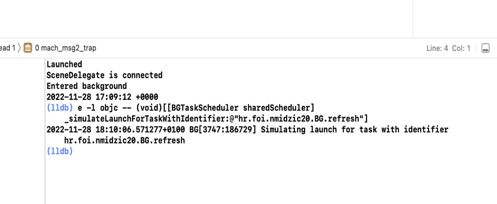

An iOS mobile application in Swift created to test background task service.

# Description

In this example, the use of background tasks for an application that displays some data fetched from a server and needs to be periodically refreshed - such as news - will be demonstrated. Similarly, these data will occasionally be removed, which could be done e.g. for old news that are no longer relevant and only consume disk space. A physical device is required for testing in this example.

Initially, the data will only consist of one piece of information, in the form of the word "podatak" ("data") and the time of its generation, to make it easier to distinguish between different pieces of data. When the application is opened, the view looks as shown in the image below.


The class MockServer will be responsible for fetching data from the server. Since there is no real server in this example, it will simply generate some data along with the date of their generation, which simulate news that should come to the application.

The update logic here simply adds new "data" with the generated date to the data variable and puts them on a new line. It utilizes `Thread.sleep` to pause the thread for two seconds each time a new piece of data is added. This simulates the process of fetching from the server, which may take some time, and achieves the effect of adding each new piece of data to the application feed one by one, instead of displaying all new data at once.

The deletion logic simply assigns an empty string to the data variable. The background task `BackgroundProcessingTask`, which utilizes it, will periodically remove all data from the application screen. The `BackgroundAppRefreshTask` will periodically fetch new data and display them in the application. Also, a 2-second delay is simulated during deletion, although actual `BackgroundProcessingTasks` might take longer than `BackgroundAppRefreshTasks`. An implementation could be made to delete only the oldest data, simulating the removal of older news and keeping newer ones.

The issue now is how to test it. Essentially, we should observe over time how the application behaves, i.e., whether it refreshes and deletes data at the desired intensity. However, when we don't have time for that, we can use the tools provided by XCode for debugging background tasks.

First, we need to build for a physical device, and when the application opens as shown on the previous image, we exit it to ensure that the `sceneDidEnterBackground` method is activated, which schedules the background services. Then we return to the application. Now, at the bottom of the project, we can click the pause button, and the debugger console will open.


We can simulate the launch of a background service using the command from Apple's documentation:

```
e -l objc -- (void)[[BGTaskScheduler sharedScheduler] _simulateLaunchForTaskWithIdentifier:@“IDENTIFIER“]
```

Instead of the word "IDENTIFIER", you should input the string identifier of the task (here, for refreshing, it is "hr.foi.nmidzic20.BG.refresh"). Also, when copying, make sure to pay attention to the quotes being used, as copying might introduce syntax errors.

This command will have the effect as if the moment is now when iOS decided to launch the service registered under that identifier when we first exited the application. As a response to the command, you should see the message: "Simulating launch for task with identifier [task_identifier]".

If instead of this message you encounter an error message, it could be due to testing on the simulator instead of a physical device, incorrect task identifiers entered in the Info.plist, or no tasks registered under that name (which means that the method registering them, such as sceneDidEnterBackground, might not have been triggered for some reason).



After the appearance of the message indicating that the task has been simulated, you can click the Play button again to resume program execution. Now, you should see new data "from the server" being added to the application screen one by one, as if the feed is being refreshed. If you pause the execution of the code again and enter the same command in the debugger as before, but this time for the data cleaning task, and then resume code execution, all data should be removed from the screen, leaving it empty until we simulate the refresh task again, or until iOS itself restarts it. The refresh and removal of data should function on the same principle over time for the application.

# Demo


